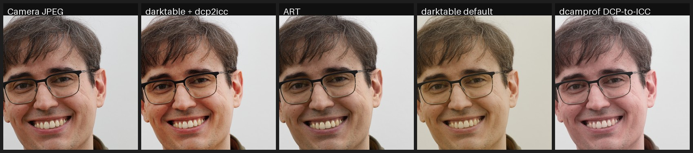

# dcp2icc

Convert DNG camera profiles (`.dcp`) into ICC input profiles that reproduce
the **camera's color rendering inside [darktable](https://www.darktable.org/)**.

darktable cannot read DCP camera profiles — the format used by Adobe,
RawTherapee and ART to describe how a camera's colors should be rendered.
The usual advice is to convert DCP to ICC with dcamprof, but that conversion
**silently drops the HueSatMap and LookTable** (the 3D color tables that carry
most of the "camera look": hue rotations and saturation boosts, e.g. up to
1.7× on skin tones) and mangles embedded tone curves. The result is a flat,
matrix-only profile that looks nothing like the camera.

`dcp2icc` implements the full DNG color pipeline instead:

```
white-balanced camera RGB
  → ForwardMatrix → XYZ (D50)
  → linear ProPhoto HSV
  → HueSatMap        (dual-illuminant, linear or sRGB encoding)
  → LookTable        (3D, value axis, sRGB encoding)
  → tone curve       (per RGB channel, like the camera; or hue-preserving)
  → CIELAB
```

…sampled into a 33³ CLUT and written as a self-contained ICC v2 profile that
darktable (via LittleCMS2) applies as an input color profile.

## How close does it get?

Test scene: Canon EOS RP raw (`.CR3`), compared against the out-of-camera
JPEG (Picture Style: Standard). The DCP is Adobe's "Camera Standard" profile
for the EOS RP, which is Adobe's replication of Canon's own rendering.




Mean absolute pixel difference against the camera JPEG (0–255 scale, lower is
better):

| Rendering | mean diff |
|---|---|
| **darktable + dcp2icc "(camera look)"** | **8.3** |
| ART default (native DCP + per-image auto-matched curve) | 10.3 |
| dcamprof DCP→ICC (color tables lost) + ACR curve | 13.2 |
| darktable factory default (agx tone mapper, standard matrix) | 13.8 |

The remaining difference vs the JPEG is mostly sharpening/noise reduction and
lens vignetting correction, which the camera applies and a color profile
cannot (enable darktable's *lens correction* module for the vignette).

## Install

Any Linux with Python ≥ 3.9 (only dependency: numpy):

```sh
pip install .            # from a checkout
# or without installing:
python -m dcp2icc.cli --help
```

On Nix/NixOS:

```sh
nix run .# -- --help     # from a checkout
nix develop              # dev shell with numpy
```

## Usage

```sh
# Convert a DCP; writes "<Camera> <Profile> (camera look).icc"
# and "<Camera> <Profile> (colors only).icc" into the current directory:
dcp2icc "Canon EOS RP Camera Standard.dcp"

# Convert and install straight into darktable's profile folder:
dcp2icc --install "Canon EOS RP Camera Standard.dcp"

# All profiles for your camera at once:
dcp2icc --install ~/dcps/"Canon EOS RP"*.dcp
```

Two variants are produced per DCP:

- **`(camera look)`** — color tables **and** the DCP tone curve baked in,
  applied per RGB channel exactly like the camera/Adobe pipeline. This is the
  faithful "camera JPEG" rendering.
- **`(colors only)`** — color tables only, no tone curve. Use this if you
  want the camera's color character but prefer darktable's scene-referred
  tone mappers (sigmoid / filmic / agx).

Useful flags: `--variant look|colors|both`, `--curve-mode channel|luminance`,
`--hsm-illuminant 1|2` (tungsten/daylight table for dual-illuminant DCPs),
`--custom-curve curve.json` (fit your own tone curve), `--grid N`.

## Getting the ICC into darktable (important!)

1. Copy the `.icc` files to `~/.config/darktable/color/in/` (created
   automatically by `--install`; Flatpak:
   `~/.var/app/org.darktable.Darktable/config/darktable/color/in/`).
2. **Restart darktable** — the folder is scanned at startup.
3. Open your raw in the darkroom and set **input color profile → profile** to
   the new entry.

For the **`(camera look)`** profiles the tone curve is already baked in, so
darktable's own tone mapping must be off or it is applied twice:

- disable **sigmoid** (or **filmic rgb** / **agx**) and **base curve**;
- set **exposure** to 0 EV (darktable's default preset adds ≈ +0.5–0.7 EV);
- set **color calibration** → adaptation to *none (bypass)* and use the
  legacy **white balance** module set to *as shot* — the profile expects
  fully white-balanced camera RGB, like RawTherapee feeds a DCP;
- optionally enable **lens correction** (the camera JPEG is
  vignette-corrected).

Save this as a darktable **style** or auto-applied preset and every raw opens
with camera colors. For the **`(colors only)`** profiles, keep your normal
scene-referred workflow — only select the profile in *input color profile*.

## Where to get DCP profiles

- **RawTherapee / ART installs** ship high-quality DCPs:
  `share/rawtherapee/dcpprofiles/` or `share/ART/dcpprofiles/`.
- **Adobe DNG Converter** (free, runs in Wine) bundles Adobe's camera
  profiles, including the "Camera Standard/Portrait/Landscape/…" replicas of
  each vendor's picture styles: look in
  `ProgramData/Adobe/CameraRaw/CameraProfiles/`.
- Any DCP you made yourself (e.g. with dcamprof + a color target) works too.

This is camera-agnostic: anything with a ForwardMatrix converts (that's
essentially every DCP; the tool tells you if not).

## Limitations

- The profile is built for the **daylight** calibration illuminant by default
  (`--hsm-illuminant`); DNG's continuous dual-illuminant interpolation cannot
  be expressed in a static ICC. In practice the difference is small.
- ICC LUT input profiles clamp the unbounded pipeline in darktable; extreme
  highlight-recovery workflows behave slightly differently than with matrix
  profiles.
- RawTherapee/ART's *auto-matched tone curve* is fitted per image and cannot
  be a static profile. `(camera look)` uses the DCP's own curve instead —
  for Adobe's "Camera *" profiles that is precisely the vendor look.

## License

GPL-3.0-or-later.
