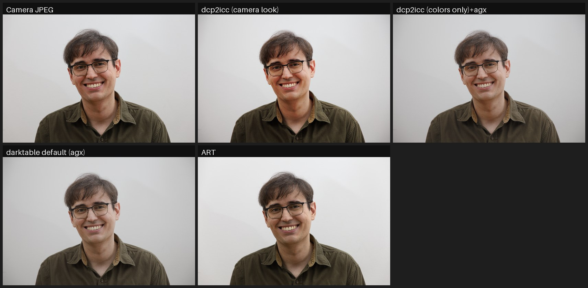

# dcp2icc

Convert DNG camera profiles (`.dcp`) into ICC input profiles that reproduce
the **camera's color rendering inside [darktable](https://www.darktable.org/)**.

darktable cannot read DCP camera profiles — the format used by Adobe and
RawTherapee to describe how a camera's colors should be rendered.
The usual advice is to convert DCP to ICC with dcamprof, but its conversion
is matrix-based: **the HueSatMap and LookTable are not carried over** — and
those 3D color tables hold most of the "camera look" (hue rotations and
saturation boosts, e.g. up to 1.7× on skin tones), so a matrix-only profile
renders noticeably flatter than the camera.

`dcp2icc` implements the full DNG color pipeline instead:

```
white-balanced camera RGB
  → ForwardMatrix → XYZ (D50)
  → linear ProPhoto HSV
  → HueSatMap        (dual-illuminant, linear or sRGB encoding)
  → LookTable        (3D, value axis, sRGB encoding)
  → tone curve       (per RGB channel, like the camera; or hue-preserving)
  → CIELAB
```

…sampled into a 33³ CLUT and written as a self-contained ICC v2 profile that
darktable (via LittleCMS2) applies as an input color profile.

## How close does it get?

Test scene: Canon EOS RP raw (`.CR3`), compared against the out-of-camera
JPEG (Picture Style: Standard). The DCP is Adobe's "Camera Standard" profile
for the EOS RP, which is Adobe's replication of Canon's own rendering.



The image and the metrics below are generated by the reproducible harness in
[`testing/`](testing/) — point it at any raw + out-of-camera JPEG pair to
test your own camera.

Mean absolute pixel difference against the camera JPEG (0–255 scale, lower is
better):

| Rendering | mean diff |
|---|---|
| RawTherapee default (native DCP + per-image auto-matched curve) | 6.2 |
| **darktable + dcp2icc "(camera look)"** | **8.3** |
| darktable + dcp2icc "(colors only)" + agx tone mapper | 12.6 |
| darktable factory default (agx tone mapper, standard matrix) | 12.8 |

RawTherapee reads the DCP natively and additionally fits a tone curve to
each image and applies lens/vignette corrections — things a static ICC
cannot do — so it is the reference ceiling. `dcp2icc (camera look)` is the
closest you can get **inside darktable**.

The two dcp2icc rows are the two profile variants: *(camera look)* carries the
camera's tone curve inside the profile and is the faithful JPEG match;
*(colors only)* keeps darktable's own scene-referred tone mapper (sigmoid /
filmic / agx — agx shown here) on top of the camera's color tables, trading
some JPEG fidelity for darktable's full highlight handling. Even in that mode
the colors are right — the remaining difference is tone curve shape.

The remaining difference vs the JPEG is mostly sharpening/noise reduction and
lens vignetting correction, which the camera applies and a color profile
cannot (enable darktable's *lens correction* module for the vignette).

## Install

Any Linux with Python ≥ 3.9 (only dependency: numpy):

```sh
pip install .            # from a checkout
# or without installing:
python -m dcp2icc.cli --help
```

On Nix/NixOS:

```sh
nix run .# -- --help     # from a checkout
nix develop              # dev shell with numpy
```

With Docker (no Python or Nix needed on the host — the image is built by Nix
internally, so it contains exactly the versions pinned by `flake.lock`):

```sh
docker build -t dcp2icc .
# same arguments as the CLI; mount the directory with your DCPs at /work:
docker run --rm --user "$(id -u):$(id -g)" -v "$PWD:/work" dcp2icc \
    "Canon EOS RP Camera Standard.dcp"
```

The `.icc` files are written to the mounted directory (`--install` is not
useful inside the container — copy the ICCs to
`~/.config/darktable/color/in/` yourself). There is also a containerized
version of the comparative test harness: see
[testing/README.md](testing/README.md).

## Usage

The workflow is: **find a DCP for your camera → run dcp2icc on it → the ICC
lands in darktable's profile folder → select it in darktable.**

### Step 1 — get a DCP file for your camera

The `.dcp` input file can live anywhere on disk; you just pass its path to
the tool. You don't need to move it anywhere special. Common sources (see
[Where to get DCP profiles](#where-to-get-dcp-profiles) for details):

```sh
# RawTherapee's bundled profiles (path varies by distro):
ls /usr/share/rawtherapee/dcpprofiles/
# Adobe's profiles, extracted from DNG Converter (via Wine):
ls ~/.wine/drive_c/ProgramData/Adobe/CameraRaw/CameraProfiles/Camera/
```

### Step 2 — convert (and install)

```sh
# Recommended: convert AND copy the result into darktable's profile folder
# (~/.config/darktable/color/in/) in one step:
dcp2icc --install "/usr/share/rawtherapee/dcpprofiles/Canon EOS RP.dcp"

# Several profiles at once:
dcp2icc --install ~/my-dcps/"Canon EOS RP"*.dcp
```

Without `--install`, the `.icc` files are written to the **current
directory** (or to `-o <dir>`), and you copy them manually:

```sh
dcp2icc -o /tmp/profiles "Canon EOS RP Camera Standard.dcp"
mkdir -p ~/.config/darktable/color/in
cp /tmp/profiles/*.icc ~/.config/darktable/color/in/
```

For **Flatpak** darktable the profile folder is
`~/.var/app/org.darktable.Darktable/config/darktable/color/in/` — use `-o`
and copy there yourself.

Each DCP produces two ICCs, named after the camera and profile name embedded
in the DCP, e.g.:

```
Canon EOS RP Camera Standard (camera look).icc
Canon EOS RP Camera Standard (colors only).icc
```

- **`(camera look)`** — color tables **and** the DCP tone curve baked in,
  applied per RGB channel exactly like the camera/Adobe pipeline. This is the
  faithful "camera JPEG" rendering.
- **`(colors only)`** — color tables only, no tone curve. Use this if you
  want the camera's color character but prefer darktable's scene-referred
  tone mappers (sigmoid / filmic / agx).

Useful flags: `--variant look|colors|both`, `--curve-mode channel|luminance`,
`--hsm-illuminant 1|2` (tungsten/daylight table for dual-illuminant DCPs),
`--custom-curve curve.json` (fit your own tone curve), `--grid N`,
`--name "My name"` (override the profile name from the DCP).

### Step 3 — select it in darktable

1. **Restart darktable** — the profile folder is only scanned at startup.
2. Open your raw in the darkroom and set **input color profile → profile** to
   the new entry (profiles appear under the name shown above).

### Step 4 — module settings that make or break it

For the **`(camera look)`** profiles the tone curve is already baked in, so
darktable's own tone mapping must be off or it is applied twice:

- disable **sigmoid** (or **filmic rgb** / **agx**) and **base curve**;
- set **exposure** to 0 EV (darktable's default preset adds ≈ +0.5–0.7 EV);
- set **color calibration** → adaptation to *none (bypass)* and use the
  legacy **white balance** module set to *as shot* — the profile expects
  fully white-balanced camera RGB, like RawTherapee feeds a DCP;
- optionally enable **lens correction** (the camera JPEG is
  vignette-corrected).

Save this as a darktable **style** or auto-applied preset and every raw opens
with camera colors. For the **`(colors only)`** profiles, keep your normal
scene-referred workflow — only select the profile in *input color profile*.

## Where to get DCP profiles

- **RawTherapee installs** ship high-quality DCPs:
  `share/rawtherapee/dcpprofiles/`.
- **Adobe DNG Converter** (free, runs in Wine) bundles Adobe's camera
  profiles, including the "Camera Standard/Portrait/Landscape/…" replicas of
  each vendor's picture styles: look in
  `ProgramData/Adobe/CameraRaw/CameraProfiles/`.
- Any DCP you made yourself (e.g. with dcamprof + a color target) works too.

This is camera-agnostic: any DCP with a ForwardMatrix converts directly, and
for older profiles that only carry a ColorMatrix (e.g. RawTherapee's Canon
EOS 5D profile) the forward matrix is derived automatically by inverting the
color matrix and Bradford-adapting the calibration illuminant to D50.

## Limitations

- The profile is built for the **daylight** calibration illuminant by default
  (`--hsm-illuminant`); DNG's continuous dual-illuminant interpolation cannot
  be expressed in a static ICC. In practice the difference is small.
- ICC LUT input profiles clamp the unbounded pipeline in darktable; extreme
  highlight-recovery workflows behave slightly differently than with matrix
  profiles.
- RawTherapee's *auto-matched tone curve* is fitted per image and cannot
  be a static profile. `(camera look)` uses the DCP's own curve instead —
  for Adobe's "Camera *" profiles that is precisely the vendor look.

## License

GPL-3.0-or-later.
