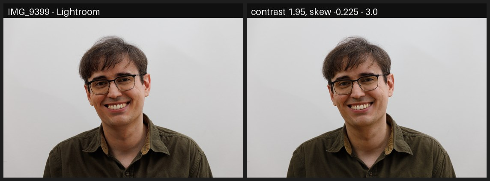

# dcp2icc

Convert DNG camera profiles (`.dcp`) into ICC input profiles that reproduce
the **camera's color rendering inside [darktable](https://www.darktable.org/)**.

darktable cannot read DCP camera profiles — the format used by Adobe and
RawTherapee to describe how a camera's colors should be rendered.
The usual advice is to convert DCP to ICC with dcamprof, but its conversion
is matrix-based: **the HueSatMap and LookTable are not carried over** — and
those 3D color tables hold most of the "camera look" (hue rotations and
saturation boosts, e.g. up to 1.7× on skin tones), so a matrix-only profile
renders noticeably flatter than the camera.

`dcp2icc` implements the full DNG color pipeline instead:

```
white-balanced camera RGB
  → ForwardMatrix → XYZ (D50)
  → linear ProPhoto HSV
  → HueSatMap        (dual-illuminant, linear or sRGB encoding)
  → LookTable        (3D, value axis, sRGB encoding)
  → tone curve       (per RGB channel, like the camera; or hue-preserving)
  → CIELAB
```

…sampled into a 33³ CLUT and written as a self-contained ICC v2 profile that
darktable (via LittleCMS2) applies as an input color profile.

## How close does it get?

Test scene: Canon EOS RP raw (`.CR3`), DCP: Adobe's "Camera Standard"
profile for the EOS RP. All numbers are the mean absolute pixel difference
on the central 80% of the frame (0–255, lower is better; ≲5 is hard to
tell apart by eye), produced by the reproducible harness in
[`testing/`](testing/) inside its pinned Docker image.

**The fair benchmark is Adobe's own rendering, not the camera JPEG.**
dcp2icc converts Adobe's DCP, so the ground truth for the conversion is
what Adobe's pipeline (Lightroom / Camera Raw) produces from the same raw
with that DCP. The camera JPEG adds in-camera processing (auto lighting
optimization, per-image tweaks, sharpening) that no DCP contains — not
even Lightroom matches it exactly. Against a Lightroom export:


| Rendering | mean diff vs Lightroom |
|---|---|
| **darktable + dcp2icc "(camera look)"** | **4.1** |
| Camera JPEG (Picture Style Standard) | 7.6 |
| darktable + dcp2icc "(colors only)" + sigmoid | 10.2 |
| darktable factory default (sigmoid, standard matrix) | 10.5 |
| RawTherapee default (native DCP) | 11.4 |

`dcp2icc (camera look)` lands **closer to Lightroom than the camera's own
JPEG does** — the DCP pipeline (color tables + tone curve) survives the
conversion to ICC essentially intact. Even RawTherapee, which reads the
DCP natively but applies its own per-image curve, is further away.

### The two profile variants

Each DCP converts into two ICCs:

- **`(camera look)`** carries the DCP tone curve inside the profile — the
  faithful match above (4.1), at the price of switching darktable's own
  tone mapping off.
- **`(colors only)`** carries only the DCP color tables and leaves the
  tone curve to darktable's scene-referred tone mapper (sigmoid / filmic /
  agx), keeping darktable's full highlight handling. With sigmoid at its
  defaults it scores 10.2 vs Lightroom — the colors are already right, the
  entire difference is tone curve shape.

That difference is two sliders away: sigmoid at **contrast 1.95,
skew −0.225** brings *(colors only)* to **3.0** vs Lightroom on the same
image — matching *(camera look)*, while staying fully scene-referred:



The tuned settings were found automatically by the parameter sweep in
[`testing/`](testing/). It is not always this close: the optimum shifts
with scene content, and on harder scenes (backlit skies, heavy in-camera
lifting) even the per-image best sigmoid stays at a visible 5–10 — see the
[per-image tables and montages](testing/Canon%20EOS%20RP/sweep/sweep-report.md)
for the whole test set.

## Install

Every tool in this repo — the converter, the DCP fetcher and the test
harness in [testing/](testing/README.md) — can be used **three ways**;
pick whichever fits your system. (Paths with spaces are shown
backslash-escaped throughout — exactly what bash/zsh tab completion
produces, no quoting needed.)

**1. Natively** — any Linux with Python ≥ 3.9 (validated on stock Ubuntu):

```sh
sudo apt install innoextract       # used by the DCP fetcher
python3 -m venv ~/.venvs/dcp2icc && ~/.venvs/dcp2icc/bin/pip install .
export PATH=~/.venvs/dcp2icc/bin:$PATH   # provides dcp2icc, dcp2icc-fetch-dcps
```

**2. Nix** (flake):

```sh
nix run .# -- --help               # the converter
nix run .#fetch-dcps               # the DCP fetcher
nix develop                        # dev shell for the testing scripts
```

**3. Docker** (no Python or Nix on the host — the images are built by Nix
internally, so they contain exactly the versions pinned by `flake.lock`):

```sh
docker build -t dcp2icc .
# converter — same arguments as the CLI, current directory mounted at /work:
docker run --rm --user "$(id -u):$(id -g)" -v "$PWD:/work" dcp2icc \
    Canon\ EOS\ RP\ Camera\ Standard
# DCP fetcher:
docker run --rm --user "$(id -u):$(id -g)" -v "$PWD:/work" \
    --entrypoint /fetch/bin/dcp2icc-fetch-dcps dcp2icc
```

The `.icc` files are written to the mounted directory (`--install` is not
useful inside the container — copy the ICCs to
`~/.config/darktable/color/in/` yourself). In Docker, file arguments are
resolved inside the container: anything under the current directory works
as-is; files elsewhere need their own mount (e.g.
`-v /path/to/my-dcps:/dcps:ro` and pass `/dcps/...`). The containerized
test harness is a separate image: see
[testing/README.md](testing/README.md).

## Usage

The workflow is: **get the DCPs → run dcp2icc → the ICC lands in
darktable's profile folder → select it in darktable.**

### Step 1 — get DCP files for your camera

The easiest way is the bundled fetcher: it downloads the official Adobe
DNG Converter from adobe.com (~1.8 GB) and extracts **all** of Adobe's
camera profiles — including the "Camera Standard/Portrait/…" replicas of
each vendor's picture styles — into a local `dcps/` folder. Nothing is
installed or executed; the installer archive is simply unpacked:

```sh
# native (needs innoextract from your distro):
dcp2icc-fetch-dcps                  # -> ./dcps/Camera/<model>/*.dcp
# Nix:
nix run .#fetch-dcps
# Docker:
docker run --rm --user "$(id -u):$(id -g)" -v "$PWD:/work" \
    --entrypoint /fetch/bin/dcp2icc-fetch-dcps dcp2icc
```

The extracted profiles are copyrighted by Adobe: they are for your own use
and must not be committed or redistributed (the `dcps/` folder is
gitignored). Alternative sources — any `.dcp` from anywhere on disk works
too, e.g. RawTherapee's bundled profiles in
`/usr/share/rawtherapee/dcpprofiles/`, or profiles you made yourself.

### Step 2 — convert (and install)

With the default `dcps/` folder populated, a bare profile name is enough —
dcp2icc looks it up automatically (`$DCP2ICC_DCP_DIR` overrides the search
locations; `~/.cache/dcp2icc/dcps` is also tried):

```sh
# native — convert AND copy into darktable's profile folder
# (~/.config/darktable/color/in/) in one step:
dcp2icc --install Canon\ EOS\ RP\ Camera\ Standard
# Nix:
nix run .# -- --install Canon\ EOS\ RP\ Camera\ Standard
# Docker (no --install: the container cannot see your darktable config;
# the ICCs land in the current directory, copy them yourself):
docker run --rm --user "$(id -u):$(id -g)" -v "$PWD:/work" dcp2icc \
    Canon\ EOS\ RP\ Camera\ Standard
```

Explicit paths work the same, several at once too:

```sh
dcp2icc --install /usr/share/rawtherapee/dcpprofiles/Canon\ EOS\ RP.dcp
dcp2icc --install dcps/Camera/Canon\ EOS\ RP/*.dcp
```

With **no profile argument at all**, every DCP found in the default
folders is converted. Point `$DCP2ICC_DCP_DIR` at one camera's folder to
convert (and `--install`) its complete profile set in one go:

```sh
DCP2ICC_DCP_DIR=dcps/Camera/Canon\ EOS\ RP dcp2icc --install
```

(Without the scoping variable this converts the entire ~4,400-profile
tree — hours of work and an unusably long profile list in darktable.)

Without `--install`, the `.icc` files are written to the **current
directory** (or to `-o <dir>`), and you copy them manually:

```sh
dcp2icc -o /tmp/profiles Canon\ EOS\ RP\ Camera\ Standard.dcp
mkdir -p ~/.config/darktable/color/in
cp /tmp/profiles/*.icc ~/.config/darktable/color/in/
```

For **Flatpak** darktable the profile folder is
`~/.var/app/org.darktable.Darktable/config/darktable/color/in/` — use `-o`
and copy there yourself.

Each DCP produces two ICCs, named after the camera and profile name embedded
in the DCP, e.g.:

```
Canon EOS RP Camera Standard (camera look).icc
Canon EOS RP Camera Standard (colors only).icc
```

- **`(camera look)`** — color tables **and** the DCP tone curve baked in,
  applied per RGB channel exactly like the camera/Adobe pipeline. This is the
  faithful "camera JPEG" rendering.
- **`(colors only)`** — color tables only, no tone curve. Use this if you
  want the camera's color character but prefer darktable's scene-referred
  tone mappers (sigmoid / filmic / agx).

Useful flags: `--variant look|colors|both`, `--curve-mode channel|luminance`,
`--hsm-illuminant 1|2` (tungsten/daylight table for dual-illuminant DCPs),
`--custom-curve curve.json` (fit your own tone curve), `--grid N`,
`--name "My name"` (override the profile name from the DCP).

### Step 3 — select it in darktable

1. **Restart darktable** — the profile folder is only scanned at startup.
2. Open your raw in the darkroom and set **input color profile → profile** to
   the new entry (profiles appear under the name shown above).

### Step 4 — module settings that make or break it

For the **`(camera look)`** profiles the tone curve is already baked in, so
darktable's own tone mapping must be off or it is applied twice:

- disable **sigmoid** (or **filmic rgb** / **agx**) and **base curve**;
- set **exposure** to 0 EV (darktable's default preset adds ≈ +0.5–0.7 EV);
- set **color calibration** → adaptation to *none (bypass)* and use the
  legacy **white balance** module set to *as shot* — the profile expects
  fully white-balanced camera RGB, like RawTherapee feeds a DCP;
- optionally enable **lens correction** (the camera JPEG is
  vignette-corrected).

For the **`(colors only)`** profiles, keep your normal
scene-referred workflow — only select the profile in *input color profile*.

## Where to get DCP profiles

- **`dcp2icc-fetch-dcps`** (see Step 1) — downloads the free Adobe DNG
  Converter and extracts its complete profile set (~4,400 DCPs for
  essentially every camera Adobe supports, including the
  "Camera Standard/Portrait/Landscape/…" picture-style replicas) into
  `dcps/`, without installing or running anything.
- **RawTherapee installs** ship high-quality DCPs:
  `share/rawtherapee/dcpprofiles/`.
- Any DCP you made yourself (e.g. with dcamprof + a color target) works too.

This is camera-agnostic: any DCP with a ForwardMatrix converts directly, and
for older profiles that only carry a ColorMatrix (e.g. RawTherapee's Canon
EOS 5D profile) the forward matrix is derived automatically by inverting the
color matrix and Bradford-adapting the calibration illuminant to D50.

## Limitations

- The profile is built for the **daylight** calibration illuminant by default
  (`--hsm-illuminant`); DNG's continuous dual-illuminant interpolation cannot
  be expressed in a static ICC. In practice the difference is small.
- ICC LUT input profiles clamp the unbounded pipeline in darktable; extreme
  highlight-recovery workflows behave slightly differently than with matrix
  profiles.
- RawTherapee's *auto-matched tone curve* is fitted per image and cannot
  be a static profile. `(camera look)` uses the DCP's own curve instead —
  for Adobe's "Camera *" profiles that is precisely the vendor look.

## License

GPL-3.0-or-later.
