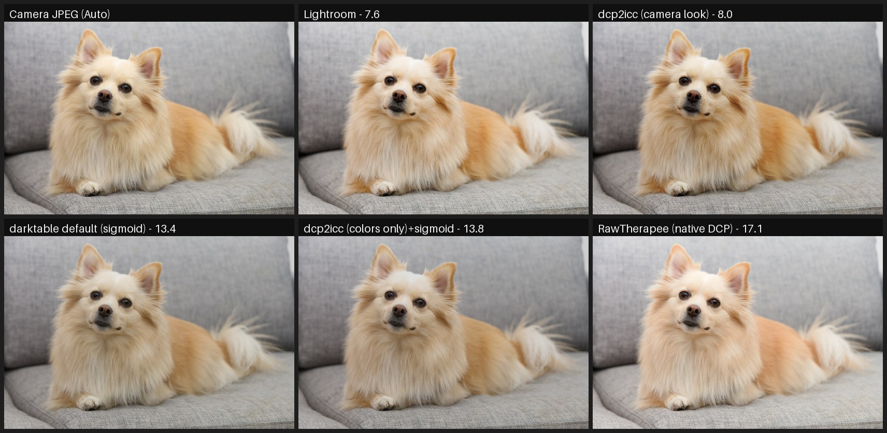
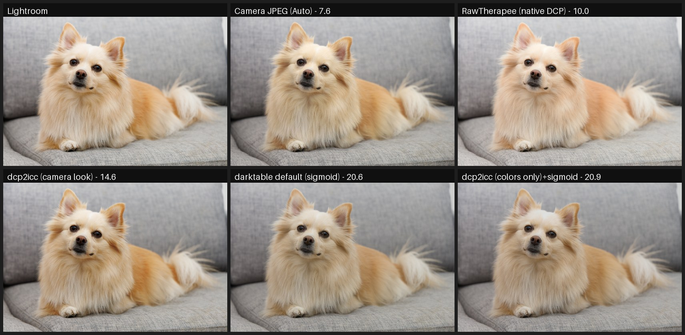
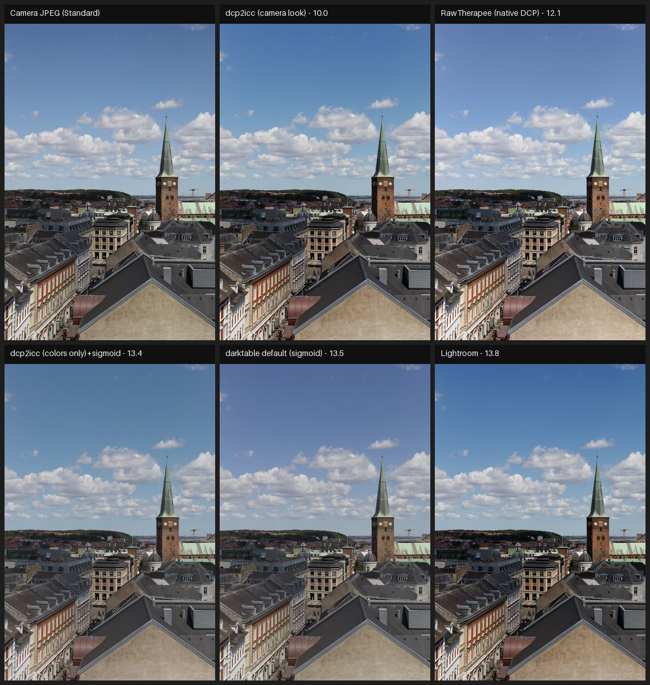
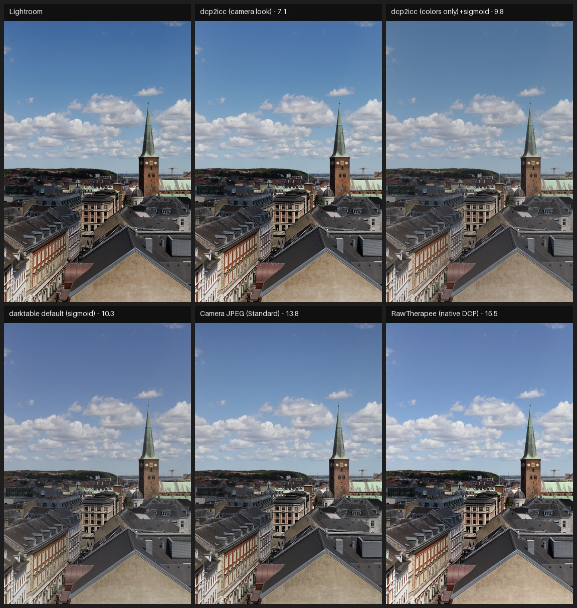
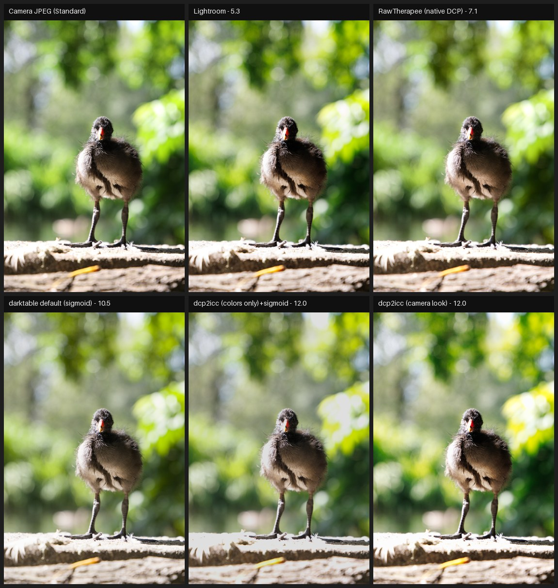
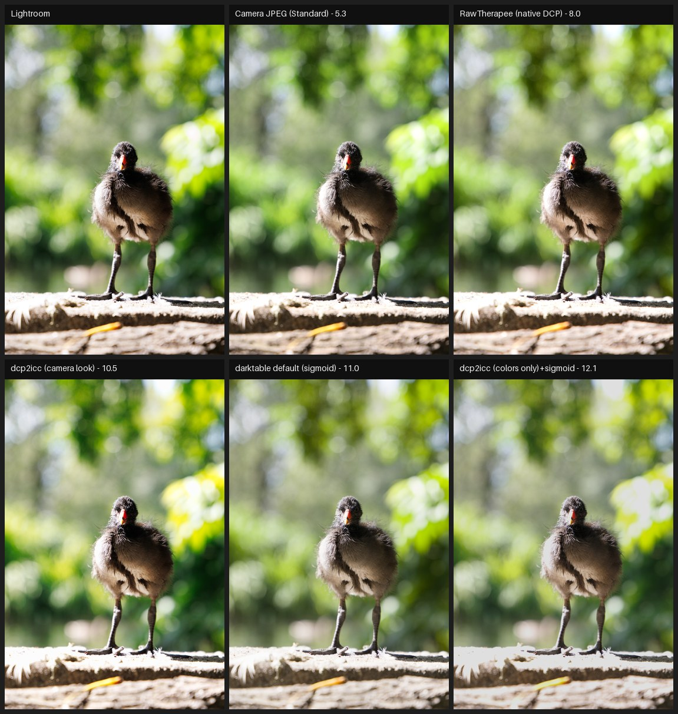
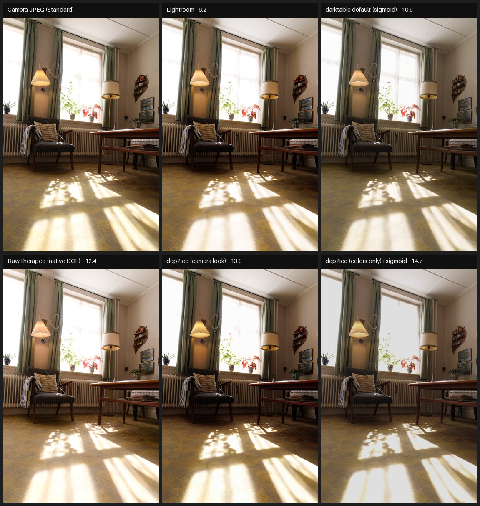
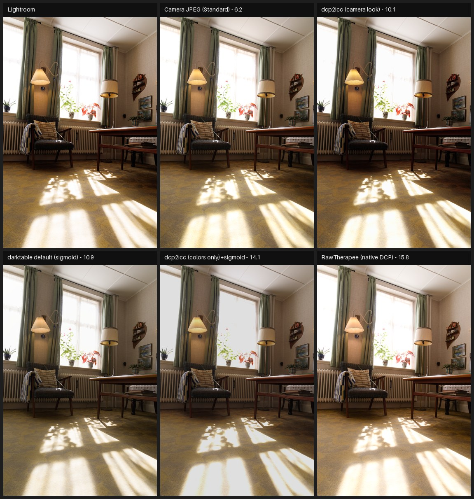
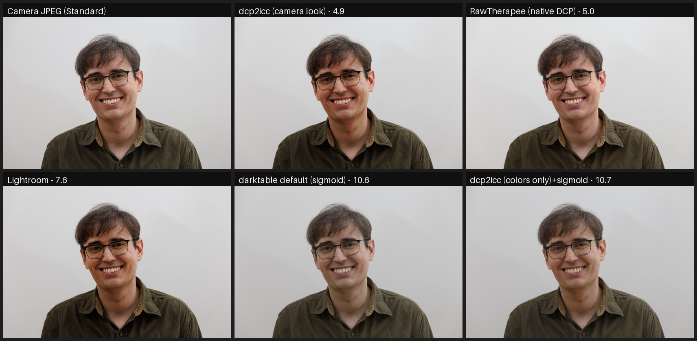
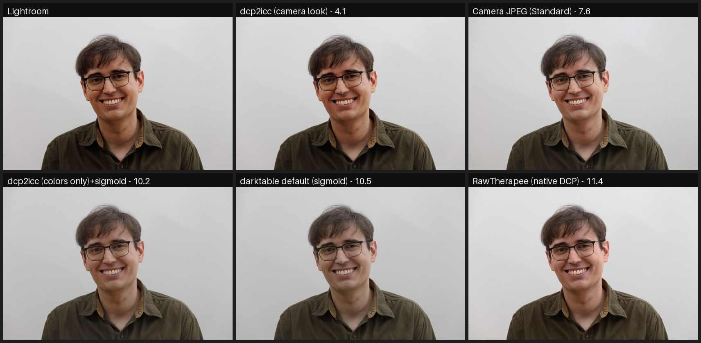

# Canon EOS RP — dcp2icc comparison suite

DCP: auto-matched per image from the camera model and Picture Style — 5 image(s), tone mapper: sigmoid. Mean absolute pixel difference on the central 80% of the frame (0–255, lower is better), against each available source of truth.

## Aggregate vs Camera JPEG (Auto)

| Rendering | mean diff | p95 | images |
|---|---|---|---|
| Lightroom | 7.6 | 13 | 1 |
| dcp2icc (camera look) | 8.0 | 18 | 1 |
| darktable default (sigmoid) | 13.4 | 24 | 1 |
| dcp2icc (colors only)+sigmoid | 13.8 | 24 | 1 |
| RawTherapee (native DCP) | 17.1 | 27 | 1 |

## Aggregate vs Lightroom

| Rendering | mean diff | p95 | images |
|---|---|---|---|
| Camera JPEG (Auto) | 7.6 | 13 | 1 |
| Camera JPEG (Standard) | 8.2 | 23 | 4 |
| dcp2icc (camera look) | 9.3 | 18 | 5 |
| RawTherapee (native DCP) | 12.1 | 23 | 5 |
| darktable default (sigmoid) | 12.6 | 25 | 5 |
| dcp2icc (colors only)+sigmoid | 13.4 | 26 | 5 |

## Aggregate vs Camera JPEG (Standard)

| Rendering | mean diff | p95 | images |
|---|---|---|---|
| Lightroom | 8.2 | 23 | 4 |
| RawTherapee (native DCP) | 9.1 | 24 | 4 |
| dcp2icc (camera look) | 10.2 | 29 | 4 |
| darktable default (sigmoid) | 11.4 | 26 | 4 |
| dcp2icc (colors only)+sigmoid | 12.7 | 28 | 4 |

## 19-43-22-103

### vs Camera JPEG (Auto)

| Rendering | mean diff | p95 |
|---|---|---|
| Lightroom | 7.6 | 13 |
| dcp2icc (camera look) | 8.0 | 18 |
| darktable default (sigmoid) | 13.4 | 24 |
| dcp2icc (colors only)+sigmoid | 13.8 | 24 |
| RawTherapee (native DCP) | 17.1 | 27 |

### vs Lightroom

| Rendering | mean diff | p95 |
|---|---|---|
| Camera JPEG (Auto) | 7.6 | 13 |
| RawTherapee (native DCP) | 10.0 | 19 |
| dcp2icc (camera look) | 14.6 | 20 |
| darktable default (sigmoid) | 20.6 | 29 |
| dcp2icc (colors only)+sigmoid | 20.9 | 28 |

## IMG_8736

### vs Camera JPEG (Standard)

| Rendering | mean diff | p95 |
|---|---|---|
| dcp2icc (camera look) | 10.0 | 40 |
| RawTherapee (native DCP) | 12.1 | 37 |
| dcp2icc (colors only)+sigmoid | 13.4 | 36 |
| darktable default (sigmoid) | 13.5 | 36 |
| Lightroom | 13.8 | 44 |

### vs Lightroom

| Rendering | mean diff | p95 |
|---|---|---|
| dcp2icc (camera look) | 7.1 | 18 |
| dcp2icc (colors only)+sigmoid | 9.8 | 22 |
| darktable default (sigmoid) | 10.3 | 22 |
| Camera JPEG (Standard) | 13.8 | 44 |
| RawTherapee (native DCP) | 15.5 | 26 |

## IMG_8919

### vs Camera JPEG (Standard)

| Rendering | mean diff | p95 |
|---|---|---|
| Lightroom | 5.3 | 16 |
| RawTherapee (native DCP) | 7.1 | 18 |
| darktable default (sigmoid) | 10.5 | 23 |
| dcp2icc (colors only)+sigmoid | 12.0 | 29 |
| dcp2icc (camera look) | 12.0 | 30 |

### vs Lightroom

| Rendering | mean diff | p95 |
|---|---|---|
| Camera JPEG (Standard) | 5.3 | 16 |
| RawTherapee (native DCP) | 8.0 | 20 |
| dcp2icc (camera look) | 10.5 | 20 |
| darktable default (sigmoid) | 11.0 | 27 |
| dcp2icc (colors only)+sigmoid | 12.1 | 28 |

## IMG_9029

### vs Camera JPEG (Standard)

| Rendering | mean diff | p95 |
|---|---|---|
| Lightroom | 6.2 | 15 |
| darktable default (sigmoid) | 10.9 | 28 |
| RawTherapee (native DCP) | 12.4 | 30 |
| dcp2icc (camera look) | 13.9 | 30 |
| dcp2icc (colors only)+sigmoid | 14.7 | 32 |

### vs Lightroom

| Rendering | mean diff | p95 |
|---|---|---|
| Camera JPEG (Standard) | 6.2 | 15 |
| dcp2icc (camera look) | 10.1 | 25 |
| darktable default (sigmoid) | 10.9 | 28 |
| dcp2icc (colors only)+sigmoid | 14.1 | 32 |
| RawTherapee (native DCP) | 15.8 | 32 |

## IMG_9399

### vs Camera JPEG (Standard)

| Rendering | mean diff | p95 |
|---|---|---|
| dcp2icc (camera look) | 4.9 | 16 |
| RawTherapee (native DCP) | 5.0 | 9 |
| Lightroom | 7.6 | 17 |
| darktable default (sigmoid) | 10.6 | 16 |
| dcp2icc (colors only)+sigmoid | 10.7 | 16 |

### vs Lightroom

| Rendering | mean diff | p95 |
|---|---|---|
| dcp2icc (camera look) | 4.1 | 9 |
| Camera JPEG (Standard) | 7.6 | 17 |
| dcp2icc (colors only)+sigmoid | 10.2 | 18 |
| darktable default (sigmoid) | 10.5 | 18 |
| RawTherapee (native DCP) | 11.4 | 19 |

