# Sigmoid parameter search — Canon EOS RP

DCP: auto-matched per image from the camera model and Picture Style, headroom profile (exposure -2.0 EV, +2.7 EV gain instance after the input profile, net +0.7 EV), adaptive search (105 renders). Mean absolute pixel difference on the central 80% of the frame (0–255, lower is better), per image and averaged, against each available source of truth.

## vs Camera JPEG (Auto)

| sigmoid setting | 19-43-22-103 | avg |
|---|---|---|
| contrast 2.175, skew -0.225 | 6.8 | **6.8** |
| contrast 1.95, skew 0.225 | 6.9 | **6.9** |
| contrast 2.4, skew -0.45 | 6.9 | **6.9** |
| contrast 2.175, skew 0.0 | 7.0 | **7.0** |
| contrast 1.95, skew 0.0 | 7.4 | **7.4** |
| contrast 2.175, skew -0.45 | 7.5 | **7.5** |
| contrast 2.4, skew -0.225 | 7.5 | **7.5** |
| contrast 1.95, skew 0.45 | 7.6 | **7.6** |
| contrast 1.725, skew 0.45 | 7.7 | **7.7** |
| contrast 2.175, skew 0.225 | 8.4 | **8.4** |
| contrast 1.725, skew 0.225 | 8.5 | **8.5** |
| contrast 1.95, skew -0.225 | 8.5 | **8.5** |
| contrast 2.4, skew 0.0 | 9.0 | **9.0** |
| contrast 1.95, skew -0.45 | 9.8 | **9.8** |
| contrast 1.725, skew 0.0 | 10.2 | **10.2** |
| contrast 1.725, skew -0.225 | 11.4 | **11.4** |
| contrast 1.95, skew -0.9 | 12.2 | **12.2** |
| contrast 1.5, skew 0.225 | 12.2 | **12.2** |
| contrast 1.725, skew -0.45 | 12.6 | **12.6** |
| contrast 1.5, skew 0.0 | 13.8 | **13.8** |
| contrast 1.5, skew -0.45 | 15.7 | **15.7** |

Best: **contrast 2.175, skew -0.225** (avg 6.8). Camera JPEG (Auto) vs the best configuration:

### Per-image best (vs Camera JPEG (Auto))

| image | best sigmoid setting | mean diff |
|---|---|---|
| 19-43-22-103 | contrast 2.175, skew -0.225 | 6.8 |

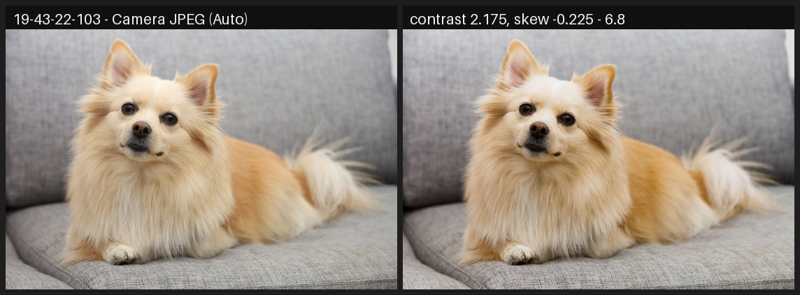

## vs Lightroom (Camera Standard)

| sigmoid setting | 19-43-22-103 | IMG_8736 | IMG_8919 | IMG_9029 | IMG_9399 | avg |
|---|---|---|---|---|---|---|
| contrast 1.95, skew -0.225 | 15.2 | 5.4 | 10.5 | 11.2 | 3.0 | **9.1** |
| contrast 1.95, skew -0.45 | 16.7 | 4.8 | 9.5 | 12.5 | 3.2 | **9.3** |
| contrast 1.725, skew 0.0 | 17.2 | 6.6 | 10.9 | 9.4 | 3.9 | **9.6** |
| contrast 1.95, skew 0.0 | 13.6 | 6.8 | 12.0 | 9.8 | 6.2 | **9.7** |
| contrast 2.175, skew -0.45 | 13.6 | 6.4 | 11.0 | 13.4 | 4.7 | **9.8** |
| contrast 1.725, skew -0.225 | 18.4 | 6.3 | 9.8 | 10.6 | 5.8 | **10.2** |
| contrast 1.725, skew 0.225 | 15.2 | 7.7 | 12.8 | 8.6 | 6.9 | **10.3** |
| contrast 2.175, skew -0.225 | 11.7 | 7.6 | 12.2 | 12.5 | 7.4 | **10.3** |
| contrast 1.95, skew -0.9 | 19.2 | 5.4 | 9.0 | 13.9 | 6.9 | **10.9** |
| contrast 1.95, skew 0.225 | 11.4 | 8.9 | 14.3 | 9.4 | 10.8 | **11.0** |
| contrast 2.175, skew 0.0 | 10.0 | 9.0 | 13.9 | 11.6 | 10.5 | **11.0** |
| contrast 1.725, skew -0.45 | 19.7 | 6.6 | 9.4 | 11.8 | 7.6 | **11.0** |
| contrast 2.4, skew -0.45 | 10.7 | 9.3 | 13.1 | 14.5 | 9.0 | **11.3** |
| contrast 1.5, skew 0.225 | 19.3 | 9.1 | 11.7 | 10.0 | 7.1 | **11.4** |
| contrast 1.725, skew 0.45 | 13.6 | 9.1 | 15.0 | 8.8 | 11.5 | **11.6** |
| contrast 2.4, skew -0.225 | 9.0 | 10.8 | 14.6 | 14.1 | 11.8 | **12.1** |
| contrast 1.5, skew 0.0 | 20.9 | 9.7 | 11.0 | 10.7 | 10.1 | **12.5** |
| contrast 2.175, skew 0.225 | 9.1 | 11.3 | 16.2 | 11.4 | 15.2 | **12.6** |
| contrast 1.95, skew 0.45 | 10.5 | 10.8 | 16.6 | 9.6 | 15.7 | **12.7** |
| contrast 2.4, skew 0.0 | 8.5 | 12.2 | 16.2 | 13.6 | 15.0 | **13.1** |
| contrast 1.5, skew -0.45 | 22.7 | 9.9 | 11.3 | 12.0 | 13.1 | **13.8** |

Best: **contrast 1.95, skew -0.225** (avg 9.1). Lightroom (Camera Standard) vs the best configuration:

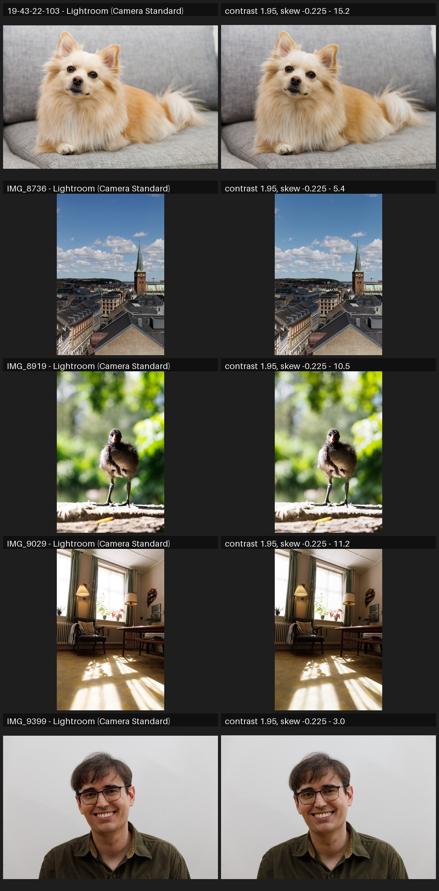

### Per-image best (vs Lightroom (Camera Standard))

| image | best sigmoid setting | mean diff |
|---|---|---|
| 19-43-22-103 | contrast 2.4, skew 0.0 | 8.5 |
| IMG_8736 | contrast 1.95, skew -0.45 | 4.8 |
| IMG_8919 | contrast 1.95, skew -0.9 | 9.0 |
| IMG_9029 | contrast 1.725, skew 0.225 | 8.6 |
| IMG_9399 | contrast 1.95, skew -0.225 | 3.0 |

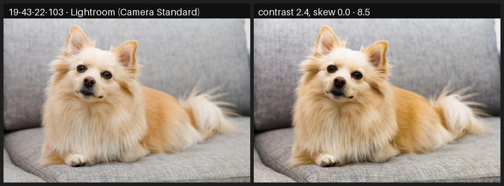

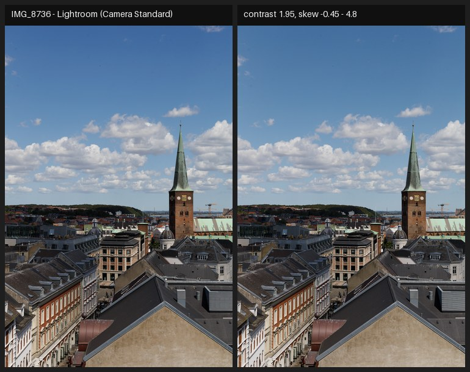

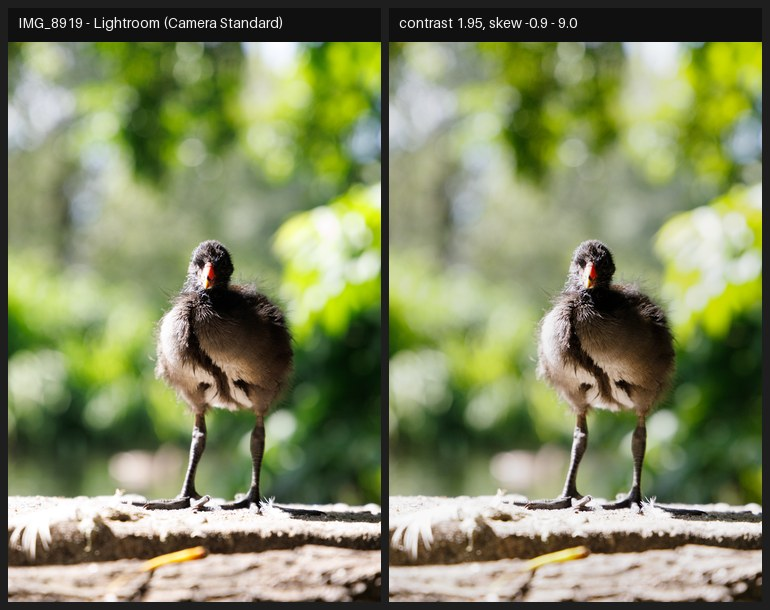

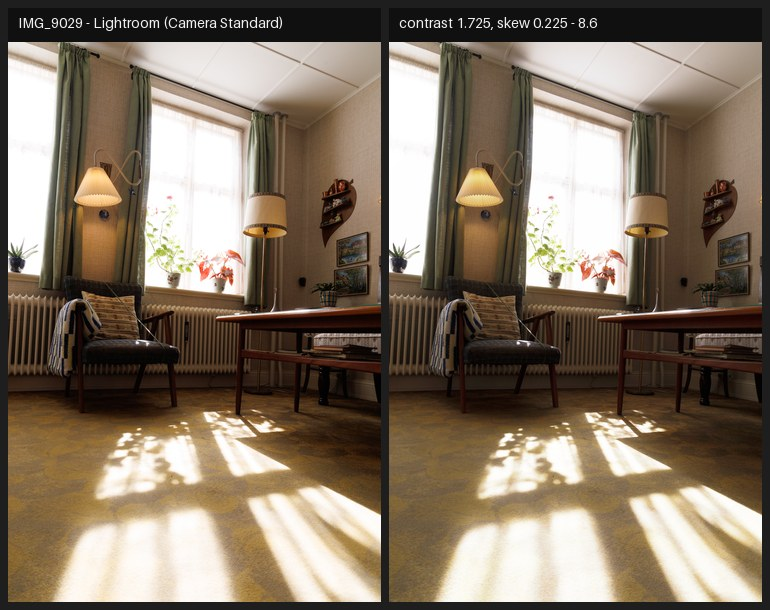

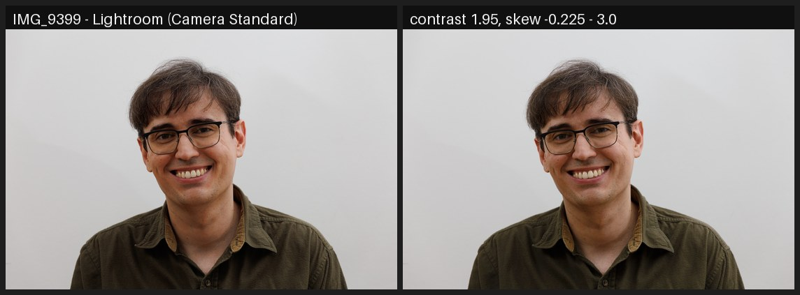

## vs Camera JPEG (Standard)

| sigmoid setting | IMG_8736 | IMG_8919 | IMG_9029 | IMG_9399 | avg |
|---|---|---|---|---|---|
| contrast 1.725, skew 0.225 | 10.7 | 13.5 | 11.2 | 4.1 | **9.9** |
| contrast 1.725, skew 0.0 | 11.3 | 11.7 | 12.2 | 6.0 | **10.3** |
| contrast 1.5, skew 0.225 | 12.8 | 12.1 | 10.4 | 7.4 | **10.7** |
| contrast 1.95, skew 0.0 | 10.7 | 13.3 | 13.9 | 5.9 | **11.0** |
| contrast 1.95, skew -0.225 | 11.3 | 12.1 | 15.3 | 6.0 | **11.2** |
| contrast 1.725, skew 0.45 | 10.9 | 15.5 | 10.8 | 8.0 | **11.3** |
| contrast 1.725, skew -0.225 | 12.0 | 10.5 | 13.9 | 9.0 | **11.3** |
| contrast 1.5, skew 0.0 | 13.4 | 11.1 | 11.5 | 10.7 | **11.7** |
| contrast 1.95, skew -0.45 | 12.1 | 11.3 | 16.4 | 8.7 | **12.1** |
| contrast 1.725, skew -0.45 | 12.7 | 10.0 | 15.3 | 11.5 | **12.4** |
| contrast 1.95, skew 0.225 | 11.3 | 15.4 | 13.2 | 9.7 | **12.4** |
| contrast 2.175, skew -0.45 | 12.1 | 13.7 | 17.9 | 6.9 | **12.6** |
| contrast 2.175, skew -0.225 | 12.5 | 14.8 | 17.1 | 8.8 | **13.3** |
| contrast 1.95, skew -0.9 | 13.3 | 10.3 | 17.6 | 12.5 | **13.4** |
| contrast 1.5, skew -0.45 | 14.1 | 10.5 | 14.3 | 14.7 | **13.4** |
| contrast 1.95, skew 0.45 | 12.5 | 17.6 | 13.0 | 13.9 | **14.2** |
| contrast 2.175, skew 0.0 | 13.2 | 16.1 | 16.2 | 11.6 | **14.3** |
| contrast 2.4, skew -0.45 | 14.2 | 16.2 | 19.4 | 10.7 | **15.1** |
| contrast 2.175, skew 0.225 | 14.8 | 18.1 | 15.8 | 15.8 | **16.1** |
| contrast 2.4, skew -0.225 | 15.4 | 17.6 | 19.0 | 13.5 | **16.4** |
| contrast 2.4, skew 0.0 | 16.6 | 19.1 | 18.4 | 16.5 | **17.7** |

Best: **contrast 1.725, skew 0.225** (avg 9.9). Camera JPEG (Standard) vs the best configuration:

### Per-image best (vs Camera JPEG (Standard))

| image | best sigmoid setting | mean diff |
|---|---|---|
| IMG_8736 | contrast 1.725, skew 0.225 | 10.7 |
| IMG_8919 | contrast 1.725, skew -0.45 | 10.0 |
| IMG_9029 | contrast 1.5, skew 0.225 | 10.4 |
| IMG_9399 | contrast 1.725, skew 0.225 | 4.1 |

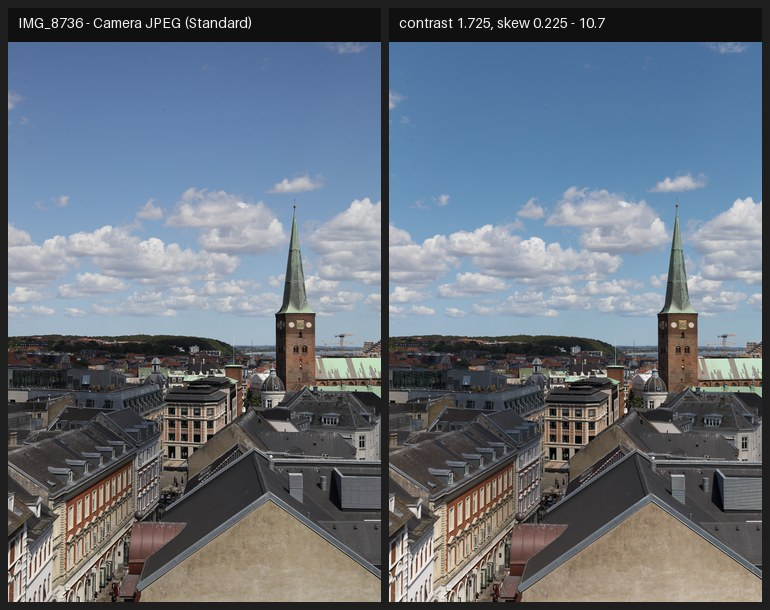

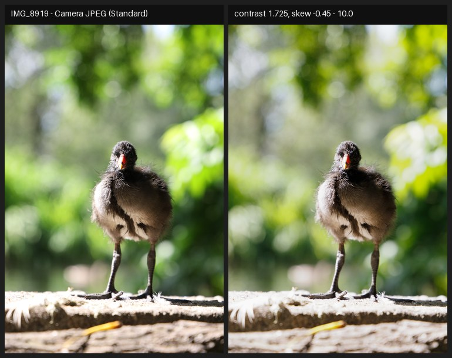

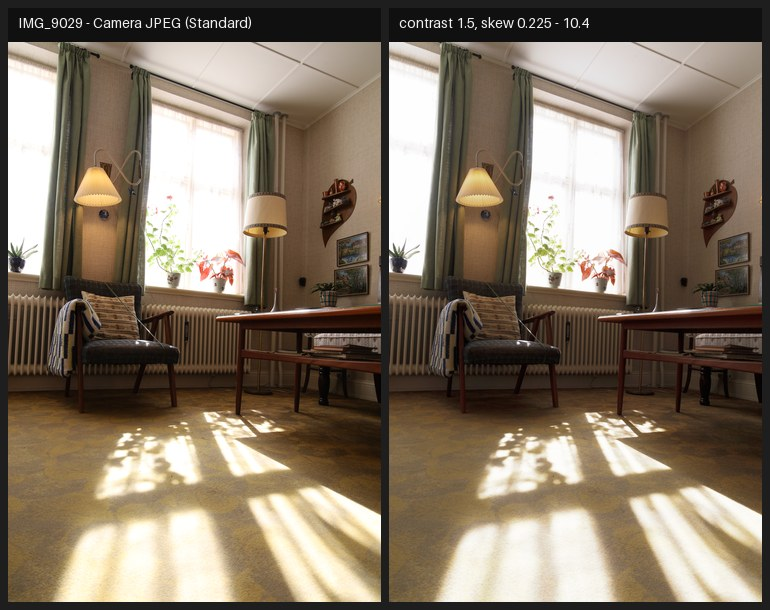

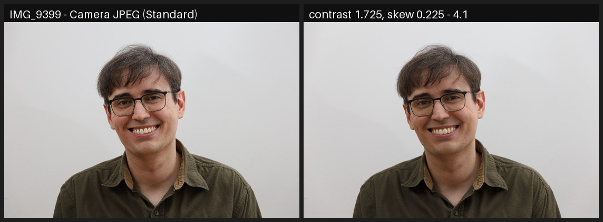
