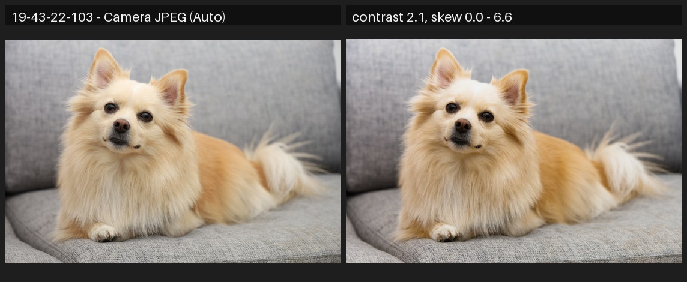
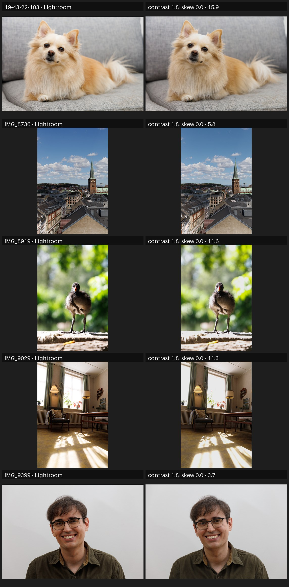
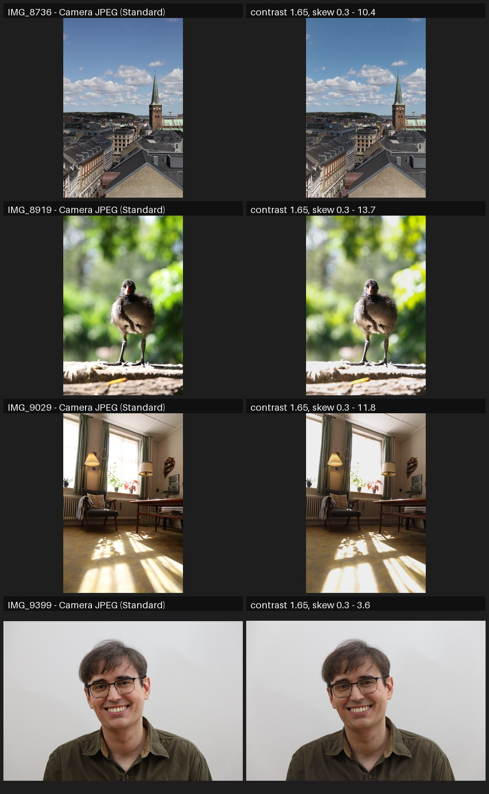

# Sigmoid parameter search — Canon EOS RP

DCP: auto-matched per image from the camera model and Picture Style, colors-only profile, exposure +0.7 EV. Mean absolute pixel difference on the central 80% of the frame (0–255, lower is better), per image and averaged, against each available source of truth.

## vs Camera JPEG (Auto)

| sigmoid setting | 19-43-22-103 | avg |
|---|---|---|
| contrast 2.1, skew 0.0 | 6.6 | **6.6** |
| contrast 1.95, skew 0.15 | 6.7 | **6.7** |
| contrast 1.95, skew 0.3 | 6.8 | **6.8** |
| contrast 2.1, skew 0.15 | 6.9 | **6.9** |
| contrast 1.8, skew 0.45 | 7.1 | **7.1** |
| contrast 1.95, skew 0.0 | 7.3 | **7.3** |
| contrast 1.8, skew 0.3 | 7.3 | **7.3** |
| contrast 1.95, skew 0.45 | 7.4 | **7.4** |
| contrast 2.1, skew 0.3 | 7.6 | **7.6** |
| contrast 1.8, skew 0.15 | 7.8 | **7.8** |
| contrast 1.65, skew 0.45 | 8.3 | **8.3** |
| contrast 1.8, skew 0.0 | 9.0 | **9.0** |
| contrast 2.1, skew 0.45 | 9.0 | **9.0** |
| contrast 1.65, skew 0.3 | 9.3 | **9.3** |
| contrast 1.65, skew 0.15 | 10.0 | **10.0** |
| contrast 1.5, skew 0.45 | 10.9 | **10.9** |
| contrast 1.65, skew 0.0 | 11.2 | **11.2** |
| contrast 1.5, skew 0.3 | 12.0 | **12.0** |
| contrast 1.5, skew 0.15 | 12.6 | **12.6** |
| preset: ACES 100-nit like | 13.4 | **13.4** |
| contrast 1.5, skew 0.0 | 13.7 | **13.7** |
| preset: scene-referred default | 13.7 | **13.7** |
| preset: smooth | 15.0 | **15.0** |
| preset: neutral gray | 17.2 | **17.2** |
| preset: Reinhard | 24.3 | **24.3** |

Best: **contrast 2.1, skew 0.0** (avg 6.6). Camera JPEG (Auto) vs the best configuration:

## vs Lightroom

| sigmoid setting | 19-43-22-103 | IMG_8736 | IMG_8919 | IMG_9029 | IMG_9399 | avg |
|---|---|---|---|---|---|---|
| contrast 1.8, skew 0.0 | 15.9 | 5.8 | 11.6 | 11.3 | 3.7 | **9.6** |
| contrast 1.95, skew 0.0 | 13.6 | 6.2 | 12.1 | 11.2 | 5.9 | **9.8** |
| contrast 1.8, skew 0.15 | 14.5 | 6.7 | 12.7 | 10.2 | 6.6 | **10.1** |
| contrast 1.65, skew 0.15 | 17.0 | 6.8 | 12.1 | 10.9 | 4.1 | **10.2** |
| contrast 2.1, skew 0.0 | 11.2 | 7.4 | 13.0 | 11.6 | 8.6 | **10.3** |
| contrast 1.95, skew 0.15 | 12.0 | 7.5 | 13.3 | 10.1 | 9.0 | **10.4** |
| contrast 1.65, skew 0.3 | 16.2 | 7.6 | 13.1 | 10.2 | 6.6 | **10.7** |
| contrast 1.65, skew 0.0 | 18.3 | 6.7 | 11.3 | 11.9 | 5.5 | **10.7** |
| contrast 1.8, skew 0.3 | 13.5 | 7.8 | 13.8 | 9.4 | 9.3 | **10.8** |
| contrast 2.1, skew 0.15 | 9.8 | 8.9 | 14.3 | 10.8 | 11.7 | **11.1** |
| contrast 1.95, skew 0.3 | 11.2 | 8.7 | 14.6 | 9.6 | 11.9 | **11.2** |
| contrast 1.65, skew 0.45 | 14.8 | 8.4 | 14.2 | 9.5 | 9.8 | **11.4** |
| contrast 1.5, skew 0.45 | 17.9 | 8.7 | 13.4 | 11.2 | 6.6 | **11.6** |
| contrast 1.8, skew 0.45 | 12.2 | 9.0 | 15.2 | 9.0 | 12.8 | **11.6** |
| contrast 1.5, skew 0.3 | 19.1 | 8.9 | 12.5 | 12.1 | 6.5 | **11.8** |
| contrast 2.1, skew 0.3 | 9.5 | 10.2 | 15.7 | 10.3 | 14.6 | **12.0** |
| contrast 1.5, skew 0.15 | 19.8 | 8.8 | 11.9 | 12.7 | 8.0 | **12.2** |
| preset: ACES 100-nit like | 20.5 | 7.8 | 10.8 | 13.4 | 9.1 | **12.3** |
| contrast 1.95, skew 0.45 | 10.4 | 10.2 | 16.1 | 9.4 | 15.5 | **12.3** |
| contrast 1.5, skew 0.0 | 20.9 | 9.3 | 11.8 | 13.4 | 10.0 | **13.1** |
| preset: scene-referred default | 20.9 | 9.3 | 11.8 | 13.4 | 10.0 | **13.1** |
| contrast 2.1, skew 0.45 | 9.5 | 11.8 | 17.3 | 10.2 | 18.2 | **13.4** |
| preset: smooth | 22.2 | 10.3 | 12.9 | 14.8 | 12.1 | **14.5** |
| preset: neutral gray | 24.4 | 15.1 | 14.6 | 17.5 | 14.7 | **17.3** |
| preset: Reinhard | 31.4 | 20.3 | 22.2 | 27.0 | 29.9 | **26.2** |

Best: **contrast 1.8, skew 0.0** (avg 9.6). Lightroom vs the best configuration:

## vs Camera JPEG (Standard)

| sigmoid setting | IMG_8736 | IMG_8919 | IMG_9029 | IMG_9399 | avg |
|---|---|---|---|---|---|
| contrast 1.65, skew 0.3 | 10.4 | 13.7 | 11.8 | 3.6 | **9.9** |
| contrast 1.65, skew 0.15 | 10.6 | 12.8 | 12.7 | 4.7 | **10.2** |
| contrast 1.8, skew 0.15 | 9.6 | 13.6 | 13.2 | 4.6 | **10.3** |
| contrast 1.5, skew 0.45 | 11.6 | 13.9 | 11.4 | 4.2 | **10.3** |
| contrast 1.8, skew 0.0 | 10.0 | 12.5 | 14.5 | 4.7 | **10.4** |
| contrast 1.65, skew 0.45 | 10.2 | 14.9 | 11.1 | 6.0 | **10.6** |
| contrast 1.8, skew 0.3 | 9.7 | 14.7 | 12.2 | 6.7 | **10.8** |
| contrast 1.5, skew 0.3 | 12.1 | 13.0 | 12.2 | 6.7 | **11.0** |
| contrast 1.65, skew 0.0 | 11.1 | 11.8 | 13.9 | 7.2 | **11.0** |
| contrast 1.95, skew 0.0 | 9.9 | 13.5 | 15.3 | 5.8 | **11.1** |
| contrast 1.5, skew 0.15 | 12.2 | 12.3 | 13.2 | 8.4 | **11.5** |
| contrast 1.95, skew 0.15 | 10.2 | 14.7 | 14.2 | 8.3 | **11.8** |
| contrast 1.8, skew 0.45 | 10.3 | 16.1 | 11.6 | 9.9 | **12.0** |
| contrast 1.5, skew 0.0 | 12.6 | 11.8 | 14.1 | 10.6 | **12.3** |
| preset: scene-referred default | 12.6 | 11.8 | 14.1 | 10.6 | **12.3** |
| preset: ACES 100-nit like | 12.3 | 11.2 | 15.5 | 10.9 | **12.4** |
| contrast 1.95, skew 0.3 | 10.6 | 15.8 | 13.2 | 10.4 | **12.5** |
| contrast 2.1, skew 0.0 | 11.2 | 15.1 | 16.3 | 9.5 | **13.0** |
| preset: smooth | 12.6 | 12.4 | 15.7 | 12.9 | **13.4** |
| contrast 1.95, skew 0.45 | 11.6 | 17.4 | 12.9 | 13.8 | **13.9** |
| contrast 2.1, skew 0.15 | 12.1 | 16.3 | 15.5 | 12.2 | **14.0** |
| contrast 2.1, skew 0.3 | 12.7 | 17.4 | 14.7 | 14.5 | **14.8** |
| preset: neutral gray | 16.5 | 14.2 | 14.8 | 14.0 | **14.9** |
| contrast 2.1, skew 0.45 | 14.0 | 18.9 | 14.5 | 17.9 | **16.3** |
| preset: Reinhard | 21.8 | 19.2 | 23.3 | 29.0 | **23.3** |

Best: **contrast 1.65, skew 0.3** (avg 9.9). Camera JPEG (Standard) vs the best configuration:

